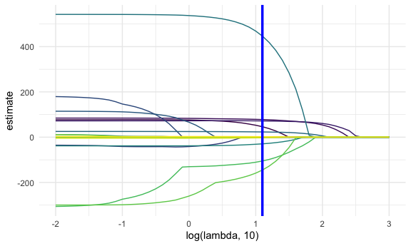
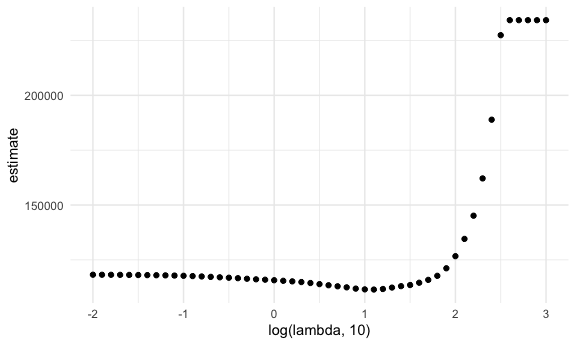
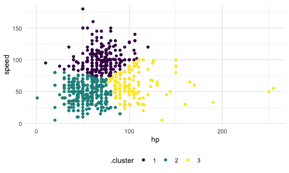
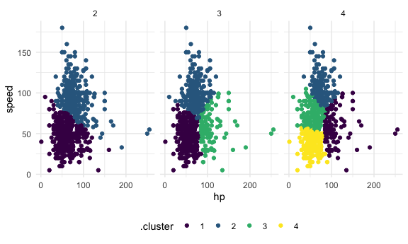
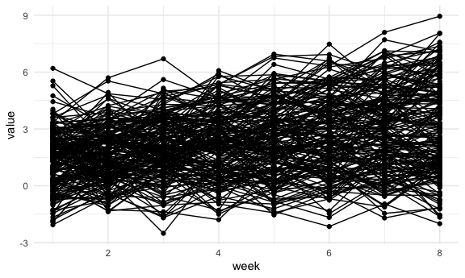
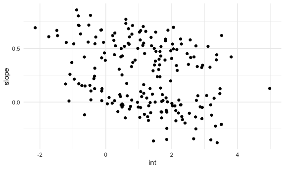
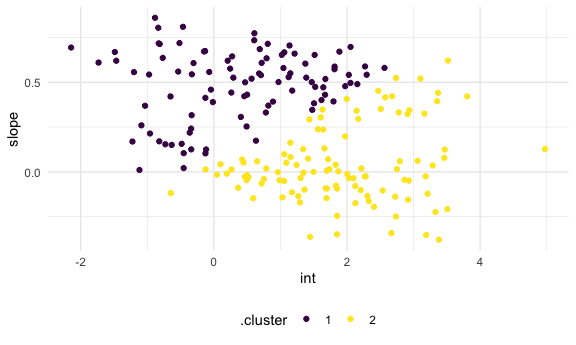
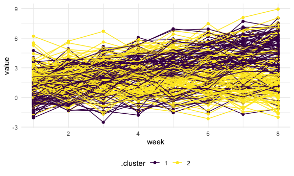

Statistical Learning
================
Minjie Bao
2021-01-10

``` r
library(tidyverse)
library(glmnet)
set.seed(11)


knitr::opts_chunk$set(
  fig.width = 6,
  fig.asp = .6,
  out.width = "90%"
)
theme_set(theme_minimal() +  theme(legend.position = "bottom"))

options(
  ggplots2.continuous.color = "viridis",
  ggplots2.continuous.fill = "viridus"
)

scale_colour_discrete = scale_colour_viridis_d
scale_fill_discrete = scale_fill_viridis_d
```

## Lasso

``` r
bwt_df = 
  read_csv("./data/birthweight.csv") %>% 
  janitor::clean_names() %>% 
  mutate(
    babysex = as.factor(babysex),
    babysex = fct_recode(babysex, "male" = "1", "female" = "2"),
    frace = as.factor(frace),
    frace = fct_recode(frace, "white" = "1", "black" = "2", "asian" = "3", "puerto rican" = "4", "other" = "8"),
    malform = as.logical(malform),
    mrace = as.factor(mrace),
    mrace = fct_recode(mrace, "white" = "1", "black" = "2", "asian" = "3", "puerto rican" = "4")
  ) %>% 
  sample_n(200)
```

    ## Parsed with column specification:
    ## cols(
    ##   .default = col_double()
    ## )

    ## See spec(...) for full column specifications.

``` r
x = model.matrix(bwt ~ ., bwt_df) [,-1]
y = bwt_df$bwt
```

``` r
lambda = 10^(seq(3, -2, -0.1))

lasso_fit =
  glmnet(x, y, lambda = lambda)

lasso_cv = 
  cv.glmnet(x, y, lambda = lambda)

lambda_opt = lasso_cv$lambda.min
```

``` r
broom::tidy(lasso_fit) %>% 
  select(term, lambda, estimate) %>% 
  complete(term, lambda, fill = list(estimate = 0)) %>% 
  filter(term != "(Intercept)") %>% 
  ggplot(aes(x = log(lambda, 10), y = estimate, group = term, color = term)) +
  geom_path() +
  geom_vline(xintercept = log(lambda_opt, 10), color = "blue", size = 1.2) +
  theme(legend.position = "none")
```



``` r
broom::tidy(lasso_cv) %>% 
  ggplot(aes(x = log(lambda, 10), y = estimate)) +
  geom_point()
```



``` r
lasso_fit = 
  glmnet(x, y, lambda = lambda_opt)
lasso_fit %>% broom::tidy()
```

    ## # A tibble: 12 x 5
    ##    term               step  estimate lambda dev.ratio
    ##    <chr>             <dbl>     <dbl>  <dbl>     <dbl>
    ##  1 (Intercept)           1 -3659.      12.6     0.627
    ##  2 babysexfemale         1    46.2     12.6     0.627
    ##  3 bhead                 1    77.9     12.6     0.627
    ##  4 blength               1    71.8     12.6     0.627
    ##  5 fincome               1     0.252   12.6     0.627
    ##  6 gaweeks               1    23.1     12.6     0.627
    ##  7 malformTRUE           1   447.      12.6     0.627
    ##  8 menarche              1   -29.4     12.6     0.627
    ##  9 mraceblack            1  -105.      12.6     0.627
    ## 10 mracepuerto rican     1  -145.      12.6     0.627
    ## 11 smoken                1    -2.62    12.6     0.627
    ## 12 wtgain                1     2.32    12.6     0.627

## K means clustering

### Clustering: pokemon

``` r
poke_df = 
  read_csv("./data/pokemon.csv") %>% 
  janitor::clean_names() %>% 
  select(hp, speed)
```

    ## Parsed with column specification:
    ## cols(
    ##   `#` = col_double(),
    ##   Name = col_character(),
    ##   `Type 1` = col_character(),
    ##   `Type 2` = col_character(),
    ##   Total = col_double(),
    ##   HP = col_double(),
    ##   Attack = col_double(),
    ##   Defense = col_double(),
    ##   `Sp. Atk` = col_double(),
    ##   `Sp. Def` = col_double(),
    ##   Speed = col_double(),
    ##   Generation = col_double(),
    ##   Legendary = col_logical()
    ## )

``` r
poke_df %>% 
  ggplot(aes(x = hp, y = speed)) +
  geom_point()
```


``` r
kmeans_fit = 
  kmeans(x = poke_df, centers = 3)
```

``` r
poke_df = 
  broom::augment(kmeans_fit, poke_df)

poke_df %>% 
  ggplot(aes(x = hp, y = speed, color = .cluster)) +
  geom_point()
```



``` r
clusts = 
  tibble(k = 2:4) %>% 
  mutate(
    km_fit = map(k, ~kmeans(poke_df, .x)),
    augmented = map(km_fit, ~broom::augment(.x,poke_df))
  )

clusts %>% 
  select(-km_fit) %>% 
  unnest(augmented) %>% 
  ggplot(aes(hp, speed, color = .cluster)) +
  geom_point(aes(color = .cluster)) +
  facet_grid(~k)
```



### Clustering: trajectories

``` r
traj_data = 
  read_csv("./data/trajectories.csv")
```

    ## Parsed with column specification:
    ## cols(
    ##   subj = col_double(),
    ##   week = col_double(),
    ##   value = col_double()
    ## )

``` r
traj_data %>% 
  ggplot(aes(x = week, y = value, group = subj)) + 
  geom_point() + 
  geom_path()
```



``` r
int_slope_df = 
  traj_data %>% 
  nest(data = week:value) %>% 
  mutate(
    models = map(data, ~lm(value ~ week, data = .x)),
    result = map(models, broom::tidy)
  ) %>% 
  select(subj, result) %>% 
  unnest(result) %>% 
  select(subj, term, estimate) %>% 
  pivot_wider(
    names_from = term,
    values_from = estimate
  ) %>% 
  rename(int = "(Intercept)", slope = week)
```

``` r
int_slope_df %>% 
  ggplot(aes(x = int, y = slope)) + 
  geom_point()
```



``` r
km_fit = 
  kmeans(
    x = int_slope_df %>% select(-subj) %>% scale, 
    centers = 2)

int_slope_df =
  broom::augment(km_fit, int_slope_df)
```

``` r
int_slope_df %>% 
  ggplot(aes(x = int, y = slope, color = .cluster)) +
  geom_point()
```



``` r
left_join(traj_data, int_slope_df) %>% 
  ggplot(aes(x = week, y = value, group = subj, color = .cluster)) + 
  geom_point() + 
  geom_path() 
```

    ## Joining, by = "subj"


